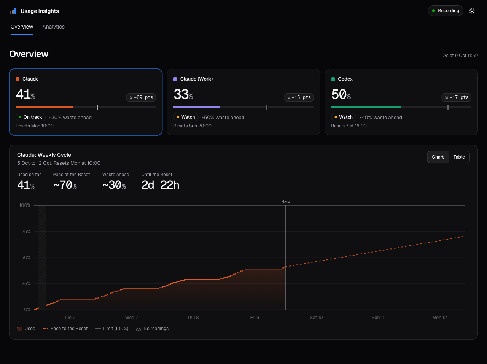
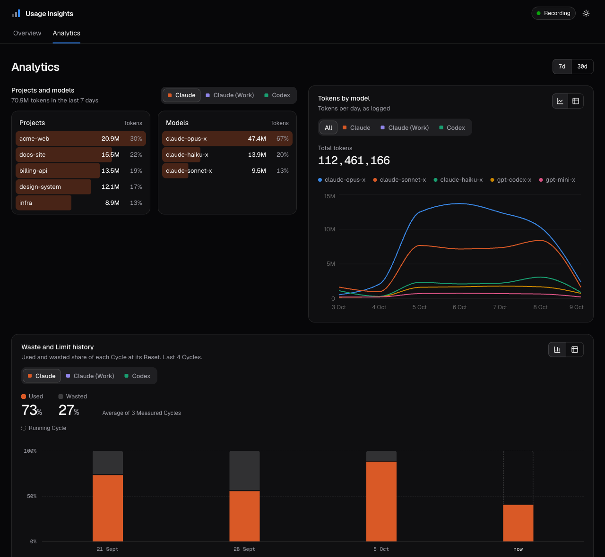

# Usage Insights

**See how much of your AI subscriptions you actually use.** Usage Insights records your Claude,
Codex, Cursor and Copilot allowances every 5 minutes and tells you where you're wasting them,
where you hit limits, and what to change.



## What you get

- **Waste per Cycle**: how much of each weekly or monthly allowance was still unused at Reset
- **Limit Hits and Blocked Time**: when you ran out, and for how long
- **Pace**: where each running Cycle is heading, before it's too late
- **A Monday card on Telegram**: the week at a glance, plus 3 Suggestions from Claude

It also splits token use per project and model, and rebuilds past history from Codex and Claude
Code logs.

## Dashboard

`bun run dashboard` opens a local dashboard at `http://127.0.0.1:6740`, dark or light:

- **Overview**: a tile per plan (used so far, Pace, status) and the running Cycle's chart
- **Analytics**: projects and models, tokens per model, Waste and Limit history, top sessions
- **Data health**: the header pill (Recording, gaps, failed runs) opens the details



Working on the app itself: `bun run dashboard` for the API, plus `bun run web:dev` for hot reload.

## Quick start

Needs macOS, [Bun](https://bun.sh) 1.2+ and [OpenUsage](https://github.com/robinebers/openusage) running.

```sh
bun install
scripts/install-launchd.sh "$PWD"          # record every 5 minutes
scripts/install-report-launchd.sh "$PWD"   # Telegram card, Mondays 09:00
bun run dashboard                           # open http://127.0.0.1:6740
```

## Commands

| Command | Does |
|---|---|
| `bun run dashboard` | Local dashboard (builds the `web/` app when stale): Overview, Analytics, data health |
| `bun run summary` | Waste, Limit Hits, Overage and Pace in the terminal |
| `bun run status` | Latest reading per provider |
| `bun run report --dry-run` | Preview the weekly card without sending |
| `bun run setup:draft` | Draft `setup.md`, the context Claude uses for Suggestions |

## How it works

`OpenUsage local API → recorder (launchd) → SQLite → dashboard + weekly report`

## Privacy

Your data never leaves your Mac and never lives in this repo. It's stored in
`~/Library/Application Support/usage-insights/`. The dashboard listens on `127.0.0.1` only.
Secrets (Anthropic key, Telegram token) are read at run time from Keychain and existing config,
never copied anywhere.

## Learn more

- [Usage guide](docs/usage.md): settings, the dashboard, launchd details, the report card, Suggestions
- [Glossary](GLOSSARY.md): what Waste, Cycle, Pace and friends mean
- [Decisions](docs/adr/): why it's built this way

## Uninstall

```sh
scripts/uninstall-launchd.sh && scripts/uninstall-report-launchd.sh   # your data is kept
```

MIT licensed.
